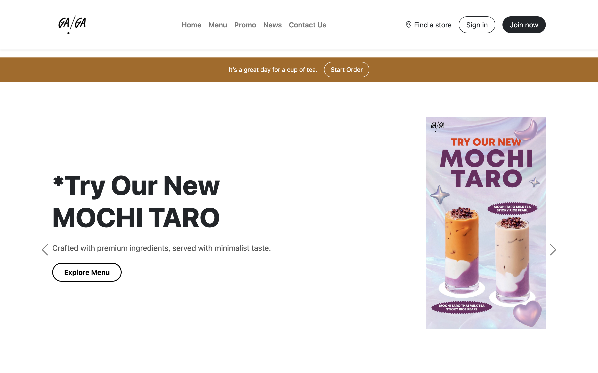
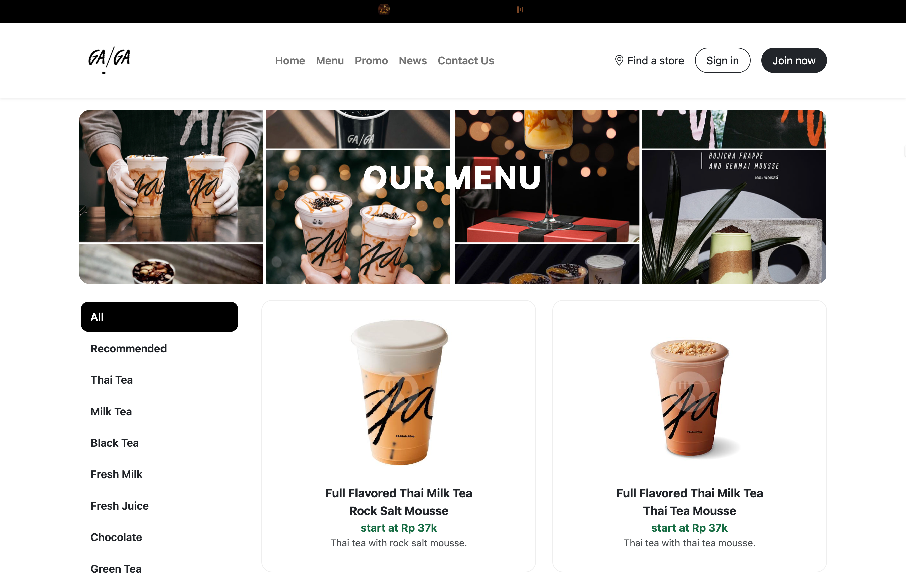

# ☕ Coffee Shop Website - Tugas Besar Prak. Desain Web


> **Website statis minimalis untuk kedai minuman dengan fitur navigasi multi-halaman responsif.**

---

## 📖 Deskripsi Proyek

Proyek ini dibuat untuk memenuhi **Tugas Besar Praktikum Desain Web (Kelas A)**. Website ini bertema **Coffee Shop** yang bertujuan untuk memberikan informasi mengenai produk, promo, berita, dan lokasi toko kepada pelanggan secara online.

Sesuai ketentuan tugas, website ini dibangun menggunakan teknologi web dasar (HTML, CSS, JS) dengan framework Bootstrap 5 agar tampilan responsif di mode desktop maupun mobile.

🔗 **Live Demo:** [gagaindo.com](http://gagaindo.com) / *(link GitHub Pages)*

---

## 👥 Anggota Kelompok (Tema: Website Coffee Shop)

| NPM | Nama Anggota | Role |
| :--- | :--- | :--- |
| **4524210141** | **Muhamad Bachtiar** | Developer / Maintainer |
| 4524210131 | Vina Aisya Hafiz | Developer / Designer |
| 4524210051 | Lilis | Developer |
| 4524210056 | Muhammad Agis Irawan | Designer |
| 4524210125 | Satrio Bagaskoro | Designer |

---

## 🛠️ Teknologi yang Digunakan

Project ini dibangun menggunakan *stack* berikut:

*  **HTML5** - Struktur utama halaman web.
*  **CSS3** - Kustomisasi gaya dan tata letak.
*  **Bootstrap 5** - Framework CSS untuk desain responsif dan komponen UI.
*  **JavaScript** - Interaktivitas website / DOM.

---

## ✨ Fitur Utama

Website ini memiliki lebih dari 5 halaman yang saling terhubung (Multi-page), sesuai dengan persyaratan tugas:

1.  🏠 **Beranda (`index.html`):** Halaman utama (*landing page*) yang menarik dengan *hero section* dan ringkasan fitur.
2.  ☕ **Menu Produk (`menu.html`):** Menampilkan daftar kopi, makanan, dan minuman lainnya.
3.  🏷️ **Promo (`promo.html`):** Informasi diskon dan penawaran khusus terkini.
4.  📰 **Berita & Blog (`news.html`):** Artikel atau berita terbaru seputar dunia kopi.
5.  📍 **Lokasi Toko (`store.html`):** Informasi lokasi cabang dan jam operasional.
6.  📞 **Kontak (`contact.html`):** Formulir kontak dan informasi sosial media.

---

## 📸 Tangkapan Layar (Screenshots)

| Beranda | Menu |
| :---: | :---: |
|  |  |

---

## 🚀 Cara Menjalankan (Instalasi)

Karena ini adalah website statis, Anda tidak memerlukan instalasi backend khusus.

1.  **Clone repositori ini:**
    ```bash
    git clone [https://github.com/siocongs/TUBES-Prak-DW-A.git](https://github.com/siocongs/TUBES-Prak-DW-A.git)
    ```
2.  **Buka folder proyek:**
    ```bash
    cd TUBES-Prak-DW-A
    ```
3.  **Jalankan:**
    * Cukup buka file `index.html` menggunakan browser favorit Anda (Chrome, Firefox, Edge, dll).
    * Atau gunakan ekstensi **Live Server** di VS Code untuk pengalaman yang lebih baik.

---

## 📂 Struktur Folder

```text
TUBES-Prak-DW-A/
├── assets/
│   ├── css/        # File Style.css
│   ├── js/         # File Script.js
│   └── img/        # Aset gambar (logo, banner, produk)
├── index.html      # Halaman Utama
├── menu.html       # Halaman Menu
├── promo.html      # Halaman Promo
├── news.html       # Halaman Berita
├── store.html      # Halaman Lokasi
├── contact.html    # Halaman Kontak
├── LICENSE         # Lisensi MIT
└── README.md       # Dokumentasi Proyek
