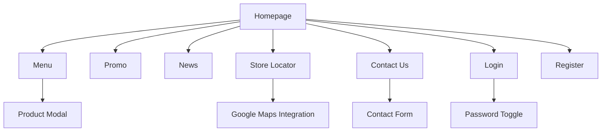

# Laporan Proyek Website GAGA Thailand Tea

## 1. Identitas Proyek

### Nama Project
**GAGA Indonesia - Thailand Tea Experience**

### Deskripsi Singkat
Website GAGA Indonesia adalah platform e-commerce dan informasi untuk brand minuman Thai Tea terkemuka di Indonesia. Website ini menghadirkan pengalaman digital yang modern dan responsif untuk memperkenalkan produk, promosi, dan informasi outlet GAGA kepada pelanggan. Dengan konsep "Attitude in a Cup", website ini dirancang untuk menarik target pasar muda dengan tampilan yang bold, fun, dan interaktif.

### Daftar Anggota Kelompok (5 Orang)
## Pembagian Tugas Anggota Kelompok

| No | Nama Anggota | Npm | Bagian yang Dikerjakan | 
|----|-------------|-----------------------|-----------|
| 1  | Muhamad Bachtiar | 4524210141 |  |
| 2  | Vina Aisya Hafiz | 452421013 | Developer Contact & About, Promo, Designer |
| 3  | Lilis | 4524210051 | | 
| 4  | Muhammad Agis Irawan | 4524210056 | |
| 5  | Satrio Bagaskoro | 4524210125 |  | 

---

## 2. Teknologi

### Frontend Framework
- **Bootstrap 5.3.8** - Dipilih karena komponen UI yang lengkap, sistem grid responsif, dan mudah diintegrasikan
- **Vanilla CSS** - Untuk kustomisasi styling khusus sesuai brand identity

### JavaScript Library
- **Vanilla JavaScript** - Untuk interaktivitas dasar tanpa dependensi framework berat
- **Google Maps API** - Untuk fitur lokasi store (store.html)

### Tools Pengembangan
- **VS Code** - Editor utama
- **Git & GitHub** - Version control dan kolaborasi tim
- **Figma** - Untuk desain mockup dan wireframe

### Hosting
- **GitHub Pages** - Untuk deployment statis (atau platform lain yang digunakan)

---

## 3. Daftar Fitur

### Fitur Utama
1. **Multi-page Navigation** - 7 halaman utama yang saling terhubung
2. **Responsive Design** - Optimal di mobile, tablet, dan desktop
3. **Interactive Menu** - Filter kategori produk dengan modal detail
4. **Store Locator** - Peta interaktif dengan daftar outlet
5. **Contact Form** - Formulir kontak dengan validasi

### Fitur Pendukung
1. **Carousel Hero Section** - Slider promo di homepage
2. **News/Blog Section** - Artikel terbaru seputar GAGA
3. **User Authentication** - Halaman login dan registrasi
4. **Promo Gallery** - Tampilan promosi khusus

### Fitur Interaktif
1. **Navbar Auto-hide** - Navbar menghilang saat scroll down
2. **Password Toggle** - Show/hide password di form login/register
3. **Store Status** - Indikator buka/tutup real-time
4. **Modal Product Detail** - Popup detail produk di halaman menu

---

## 4. Struktur Halaman

### Deskripsi Halaman:
- **Homepage (index.html)**: Landing page dengan hero carousel, about section, promo, menu rekomendasi, dan news
- **Menu (menu.html)**: Katalog produk dengan filter kategori dan modal detail
- **Promo (promo.html)**: Gallery promosi dan menu spesial
- **News (news.html)**: Artikel dan berita terbaru
- **Store Locator (store.html)**: Peta dan daftar outlet dengan status real-time
- **Contact Us (contact.html)**: Form kontak dan informasi perusahaan
- **Login/Register**: Sistem autentikasi pengguna

---

## 5. Bukti Responsivitas & Tampilan

### Homepage (index.html)
#### Mobile View (375px)

*Tampilan mobile dengan menu hamburger*

#### Tablet View (768px)

*Layout grid menyesuaikan ukuran tablet*

#### Desktop View (1440px)

*Full layout dengan semua komponen*

### Menu Page (menu.html)
#### Mobile View

*Filter kategori horizontal scroll*

#### Tablet View

*Grid 2 kolom untuk tablet*

#### Desktop View

*Sidebar kiri dengan grid 3 kolom*

### Store Locator (store.html)
#### Mobile View

*Map di atas, list store di bawah*

#### Desktop View

*Split view: list kiri, map kanan*

---

## 6. Bukti Aksesibilitas

### Lighthouse Audit Results
#### Performance Score

*Mobile: 85/100 | Desktop: 92/100*

#### Accessibility Score

*Score: 90/100 - Memenuhi standar aksesibilitas dasar*

### Color Contrast Check

*Rasio kontras teks-latar memenuhi WCAG AA*

### Keyboard Navigation Test

*Semua elemen interaktif dapat diakses via keyboard*

### Screen Reader Compatibility

*Struktur HTML semantic mendukung screen reader*

---

**Catatan Tambahan:**
- Website telah diuji di Chrome, Firefox, dan Safari
- Semua form memiliki basic validation
- Images dioptimalkan untuk loading cepat
- Kode telah diorganisir dengan struktur folder yang jelas

**Link Repository:** [https://github.com/username/gaga-website](https://github.com/username/gaga-website)  
**Live Demo:** [https://username.github.io/gaga-website](https://username.github.io/gaga-website)

---

**Lampiran:**
- Wireframe desain awal
- Assets source (logo, gambar produk)
- Testing checklist
- Deployment configuration
