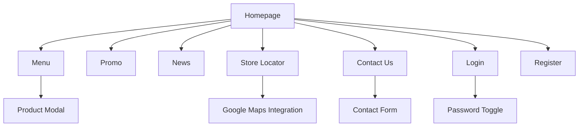

# ☕ Laporan Proyek Website Coffee Shop GAGA
> **Website statis minimalis untuk profil & store dengan fitur navigasi multi-halaman responsif.**

## 1. 📖 Identitas Proyek

### Nama Project
**GAGA Indonesia - Thailand Tea Experience**

### Deskripsi Singkat
Website GAGA Indonesia adalah platform e-commerce dan informasi untuk brand minuman Thai Tea terkemuka di Indonesia. Website ini menghadirkan pengalaman digital yang modern dan responsif untuk memperkenalkan produk, promosi, dan informasi outlet GAGA kepada pelanggan. Dengan konsep "Attitude in a Cup", website ini dirancang untuk menarik target pasar muda dengan tampilan yang bold, fun, dan interaktif.

## Pembagian Tugas Anggota Kelompok

| No | Nama Anggota | NPM | Bagian yang Dikerjakan | 
|----|-------------|-----------------------|-----------|
| 1  | Muhamad Bachtiar | 4524210141 | Developer & Designer Home, Menu, Store, Login, Register |
| 2  | Vina Aisya Hafiz | 4524210131 | Developer & Designer Contact / About, Promo |
| 3  | Lilis | 4524210051 | Developer & Designer News Page | 
| 4  | Muhammad Agis Irawan | 4524210056 | Developer & Contributor Page (Code Maintenance) |
| 5  | Satrio Bagaskoro | 4524210125 | Developer & Contributor Menu (Perbaikan Kode & Bug) | 

---

## 2. Teknologi

### Frontend Framework
- **Bootstrap 5.3.8** - Dipilih karena komponen UI yang lengkap, sistem grid responsif, dan mudah diintegrasikan
- **Vanilla CSS** - Untuk kustomisasi styling khusus sesuai brand identity

### JavaScript Library
- **Vanilla JavaScript** - Untuk interaktivitas dasar tanpa dependensi framework berat
- **Google Maps API** - Untuk fitur lokasi store (store.html)

### Tools Pengembangan
- **VS Code** - Editor utama
- **Git & GitHub** - Version control dan kolaborasi tim
- **Figma** - Untuk desain mockup dan wireframe

### Hosting
- **GitHub Pages** - Untuk deployment statis & performa cepat
- **Netlify** - Untuk deployment dengan sortlink

---

## 3. Daftar Fitur

### Fitur Utama
1. **Multi-page Navigation** - 8 halaman utama yang saling terhubung
   
2. **Responsive Design** - Optimal di mobile, tablet, dan desktop

| Desktop (1440px) | Tablet/Pad (768px) | Mobile (375px) |
| :-: | :-: | :-: |
|  |  |  |
| *Full layout dengan semua komponen* | *Layout grid menyesuaikan ukuran tablet* | *Tampilan mobile dengan menu hamburger* |
3. **Interactive Menu** - Filter kategori produk dengan modal detail

| Desktop | Tablet/Pad | Mobile |
| :-: | :-: | :-: |
|  |  |  |
| *Sidebar kiri dengan grid 3 kolom* | *Grid 1 kolom untuk tablet* | *Filter kategori horizontal scroll* |

4. **Store Locator** - Peta interaktif dengan daftar outlet

| Desktop | Mobile |
| :-: | :-: |
|  |  |
| *Split view: list kiri, map kanan* | *Map di atas, list store di bawah* |

6. **Contact Form** - Formulir kontak dengan validasi

### Fitur Pendukung
1. **Carousel Hero Section** - Slider promo di homepage
2. **News/Blog Section** - Artikel terbaru seputar GAGA
3. **User Authentication** - Halaman login dan registrasi
4. **Promo Gallery** - Tampilan promosi khusus

### Fitur Interaktif
1. **Navbar Auto-hide** - Navbar menghilang saat scroll down
2. **Password Toggle** - Show/hide password di form login/register
3. **Store Status** - Indikator buka/tutup real-time
4. **Modal Product Detail** - Popup detail produk di halaman menu

---

## 4. Struktur Halaman

### Deskripsi Halaman:
- **Homepage (index.html)**: Landing page dengan hero carousel, about section, promo, menu rekomendasi, dan news
- **Menu (menu.html)**: Katalog produk dengan filter kategori dan modal detail
- **Promo (promo.html)**: Gallery promosi dan menu spesial
- **News (news.html)**: Artikel dan berita terbaru
- **Store Locator (store.html)**: Peta dan daftar outlet dengan status real-time
- **Contact Us (contact.html)**: Form kontak dan informasi perusahaan
- **Login/Register**: Sistem autentikasi pengguna

---

## 5. Bukti Responsivitas & Tampilan

### Homepage (index.html)
| Desktop (1440px) | Tablet/Pad (768px) | Mobile (375px) |
| :-: | :-: | :-: |
|  |  |  |
| *Full layout dengan semua komponen* | *Layout grid menyesuaikan ukuran tablet* | *Tampilan mobile dengan menu hamburger* |

### Menu Page (menu.html)
| Desktop | Tablet/Pad | Mobile |
| :-: | :-: | :-: |
|  |  |  |
| *Sidebar kiri dengan grid 3 kolom* | *Grid 1 kolom untuk tablet* | *Filter kategori horizontal scroll* |

### Store Locator (store.html)
| Desktop | Mobile |
| :-: | :-: |
|  |  |
| *Split view: list kiri, map kanan* | *Map di atas, list store di bawah* |

---

## 6. Bukti Aksesibilitas

### Lighthouse Audit Results
#### Performance Score
| Desktop: 97/100 | Mobile: 67/100 |
| :-: | :-: |
|  |  |

#### Accessibility Score
| Score: 72/100 |
| :-: |
|  |

### Color Contrast Check

  
   
  <em>Rasio kontras teks-latar memenuhi WCAG AA</em>

### Keyboard Navigation Test

  
   
  <em>Navigasi & Elemen bisa diakses menggunakan Keyboard (Tab index)</em>

### Screen Reader Compatibility

  
   
  <em>Struktur HTML semantic mendukung screen reader</em>

---

**Catatan Tambahan:**
- Website telah diuji di Chrome, Firefox, dan Safari
- Semua form memiliki basic validation
- Images dioptimalkan untuk loading cepat
- Kode telah diorganisir dengan struktur folder yang jelas

### Live Demo
| Platform | Link | Status |
| :--- | :--- | :---: |
| **GitHub Pages** |  | 🟢 |
| **Netlify** |  | 🟢 |

---

**Lampiran:**
- [Wireframe desain awal](https://www.figma.com/design/ngEfFo1N9C4NtvvaK0fpOF/WIREFRAME-PRAK-DW?node-id=0-1&t=EgSVGV8jri49VTyx-1)
- [Assets source (logo, gambar produk, screenshot)](https://github.com/siocongs/TUBES-Prak-DW-A/tree/main/assets)
- Testing checklist
- Deployment configuration
