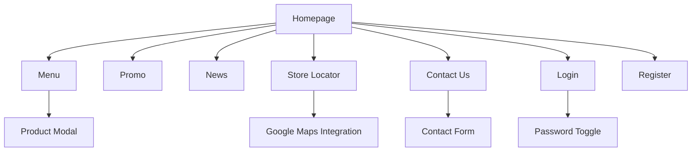

# ☕ Laporan Proyek Website Coffee Shop GAGA
> **Website statis minimalis untuk profil & store dengan fitur navigasi multi-halaman responsif.**

## 1. 📖 Identitas Proyek

### Nama Project
**GAGA Indonesia - Thailand Tea Experience**

### Deskripsi Singkat
Website GAGA Indonesia adalah platform e-commerce dan informasi untuk brand minuman Thai Tea terkemuka di Indonesia. Website ini menghadirkan pengalaman digital yang modern dan responsif untuk memperkenalkan produk, promosi, dan informasi outlet GAGA kepada pelanggan. Dengan konsep "Attitude in a Cup", website ini dirancang untuk menarik target pasar muda dengan tampilan yang bold, fun, dan interaktif.

## Pembagian Tugas Anggota Kelompok

| No | Nama Anggota | NPM | Bagian yang Dikerjakan | 
|----|-------------|-----------------------|-----------|
| 1  | Muhamad Bachtiar | 4524210141 | Developer & Designer Home, Menu, Store, Login, Register |
| 2  | Vina Aisya Hafiz | 4524210131 | Developer & Designer Contact / About, Promo |
| 3  | Lilis | 4524210051 | Developer & Designer News Page | 
| 4  | Muhammad Agis Irawan | 4524210056 | Developer & Contributor Page (Code Maintenance) |
| 5  | Satrio Bagaskoro | 4524210125 | Developer & Contributor Menu (Perbaikan Kode & Bug) | 

---

## 2. Teknologi

### Frontend Framework
- **Bootstrap 5.3.8** - Dipilih karena komponen UI yang lengkap, sistem grid responsif, dan mudah diintegrasikan
- **Vanilla CSS** - Untuk kustomisasi styling khusus sesuai brand identity

### JavaScript Library
- **Vanilla JavaScript** - Untuk interaktivitas dasar tanpa dependensi framework berat
- **Google Maps API** - Untuk fitur lokasi store (store.html)

### Tools Pengembangan
- **VS Code** - Editor utama
- **Git & GitHub** - Version control dan kolaborasi tim
- **Figma** - Untuk desain mockup dan wireframe

### Hosting
- **GitHub Pages** - Untuk deployment statis & performa cepat
- **Netlify** - Untuk deployment dengan sortlink

---

## 3. Daftar Fitur

### Fitur Utama
1. **Multi-page Navigation** - 8 halaman utama yang saling terhubung
   
2. **Responsive Design** - Optimal di mobile, tablet, dan desktop

| Desktop (1440px) | Tablet/Pad (768px) | Mobile (375px) |
| :-: | :-: | :-: |
|  |  |  |
| *Full layout dengan semua komponen* | *Layout grid menyesuaikan ukuran tablet* | *Tampilan mobile dengan menu hamburger* |
3. **Interactive Menu** - Filter kategori produk dengan modal detail

| Desktop | Tablet/Pad | Mobile |
| :-: | :-: | :-: |
|  |  |  |
| *Sidebar kiri dengan grid 3 kolom* | *Grid 1 kolom untuk tablet* | *Filter kategori horizontal scroll* |

4. **Store Locator** - Peta interaktif dengan daftar outlet

| Desktop | Mobile |
| :-: | :-: |
|  |  |
| *Split view: list kiri, map kanan* | *Map di atas, list store di bawah* |

6. **Contact Form** - Formulir kontak dengan validasi
   

      
   

### Fitur Pendukung
1. **Carousel Hero Section** - Slider promo di homepage
   

      
   

3. **News/Blog Section** - Artikel terbaru seputar GAGA
   

      
   

5. **User Authentication** - Halaman login dan registrasi

| Login | Registrasi |
| :-: | :-: |
|  |  |

7. **Promo Gallery** - Tampilan promosi khusus
   

      
   

### Fitur Interaktif
1. **Navbar Auto-hide** - Navbar menghilang saat scroll down
   

      
   

3. **Password Toggle** - Show/hide password di form login/register
      

         
         
      

5. **Store Status** - Indikator buka/tutup real-time
   

      
   

7. **Modal Product Detail** - Popup detail produk di halaman menu
   

      
   

### Screenshoot Code
1. Beranda (index.html)
Halaman utama yang memperkenalkan brand GAGA Indonesia, menampilkan produk unggulan, promo, berita, dan mengarahkan pengunjung untuk memesan.
Isi Fitur:
- Hero Carousel – Menampilkan 3 slide produk terbaru (Mochi Taro, Signature Series, dll) dengan gambar menarik dan call-to-action
  1
- About Section – Cerita singkat tentang GAGA sebagai #1 Authentic Thai Milk Tea dengan konsep "Attitude in a Cup"
  
- Promo Section – 2 kartu promo dengan desain dark/light untuk menampilkan New Signature Series dan Limited Edition
  
- Menu Recommendation – 3 produk rekomendasi dengan rating dan deskripsi
  
- News Section – 4 berita terbaru tentang kegiatan GAGA dengan tanggal dan gambar
  
- Fixed Navigation Bar – Menu navigasi lengkap dengan logo, fitur "Find a Store", Sign In, dan Join Now
- Top Bar – Bar kecil di atas navbar dengan pesan motivasi dan tombol "Start Order"
- Footer Komprehensif – Logo, informasi kantor, layanan perlindungan konsumen, dan media sosial
  

2. Menu (menu.html)
Halaman katalog produk lengkap dengan sistem filter kategori untuk memudahkan pencarian minuman.
Isi Fitur:
- Hero Banner – Gambar besar dengan judul "OUR MENU"
- Sidebar Kategori – 13 kategori produk: All, Recommended, Thai Tea, Milk Tea, Black Tea, Fresh Milk, Fresh Juice, Chocolate, Green Tea, Coffee, Frappe, Dessert, Signature
- Grid Produk – Display produk dengan gambar, nama, harga, dan tombol detail
- Product Modal – Popup detail produk yang muncul saat mengklik item (menampilkan gambar besar, nama, harga, deskripsi, dan tombol pesan)
- Filter JavaScript – Sistem filter real-time berdasarkan kategori
- Responsive Layout – Layout sidebar + grid yang responsif untuk desktop/mobile

3. Promo (promo.html)
Halaman khusus untuk menampilkan penawaran dan promo terbaru.
Isi Fitur:
- Promo Cards Layout – 3 kartu promo besar dengan desain alternating (dark/light)
- Promo Menu Section – Grid 3 produk yang sedang promo dengan rating dan deskripsi
- Visual Konten – Gambar produk yang menarik dengan teks promo jelas
- Call-to-Action – Tombol "Explore Menu" dan "See Promo" yang mengarah ke halaman terkait

4. Berita (news.html)
Halaman blog/news untuk update terbaru tentang GAGA.
Isi Fitur:
- News Grid – 8 kartu berita dengan layout grid responsive
- Konten Berita – Setiap kartu berisi: gambar, tanggal, judul, deskripsi singkat, dan link "Baca selengkapnya"
- Topik Variatif – Berita tentang: komitmen keberlanjutan, pembukaan store baru, promo event, pertumbuhan bisnis
- Header Section – Judul halaman dan deskripsi singkat

5. Kontak (contact.html)
Halaman kontak dan tentang perusahaan.
Isi Fitur:
- About Section – 2 blok cerita: "Our Story" (sejarah brand) dan "About our Products" (sertifikasi halal)
- Contact Hero – Header dengan judul dan tab (Pertanyaan/Customer Service)

Contact Container – Layout 2 kolom:
- Kiri: Informasi kontak (telepon, email, alamat kantor)
- Kanan: Form kontak dengan field: Nama, Email, Telepon, Pesan, dan tombol Send
- Informasi Detail – Alamat lengkap kantor pusat dan nomor telepon resmi

6. Login (login.html)
Halaman autentikasi untuk member yang sudah terdaftar.
Isi Fitur:
- Login Form – Form sederhana dengan: Username/Email, Password (dengan toggle visibility)
- Remember Me – Checkbox "Keep me signed in"
- Forgot Links – Link untuk lupa username/password
- Join Rewards Section – Promo untuk bergabung dengan GAGA Rewards (exclusive promos, birthday treats)
- Password Toggle – Fitur show/hide password dengan icon eye

7. Registrasi (register.html)
Halaman pendaftaran member baru.
Isi Fitur:
Registration Form – Form 2 bagian:
- Personal Information (First name, Last name)
- Account Security (Email sebagai username, Password dengan requirements)
- Password Requirements – Petunjuk panjang dan karakteristik password
- Password Toggle – Fitur show/hide password
- Clean Layout – Form dengan shadow dan rounded corners untuk UX yang baik

8. Toko (store.html)
Halaman pencarian lokasi toko GAGA.
Isi Fitur:
- Dual Mode – Tab Pickup vs Delivery

Pickup Mode:
- Search box untuk mencari toko
- Store list dengan detail lokasi
- Integration dengan Google Maps API
- Delivery Mode – Informasi delivery service dengan partner
- Interactive Map – Google Maps integration untuk menunjukkan lokasi toko
- Store Details – Informasi jam operasional dan alamat lengkap

Fitur Umum yang Konsisten di Semua Halaman:
- Navigation Bar – Konsisten dengan logo, menu utama, dan auth buttons
- Top Bar – "It's a great day for a cup of tea" + Start Order button
- Footer – Sama di semua halaman dengan: logo, office info, consumer protection, social media
- Responsive Design – Menggunakan Bootstrap 5 untuk mobile-friendly
- Brand Consistency – Warna, font, dan styling yang konsisten
- Icon Set – Menggunakan Bootstrap Icons untuk visual yang rapi

Teknologi yang Digunakan:
- Frontend: HTML5, CSS3, JavaScript
- Framework: Bootstrap 5.3.8
- Icons: Bootstrap Icons
- Maps: Google Maps API (untuk store locator)
- Structure: Assets terorganisir (css/, js/, img/)

Setiap halaman memiliki tujuan yang jelas dan mengarahkan pengunjung melalui customer journey: dari pengenalan brand → melihat produk → promo → informasi kontak → registrasi → pemesanan.
---

## 4. Struktur Halaman

### Deskripsi Halaman:
- **Homepage (index.html)**: Landing page dengan hero carousel, about section, promo, menu rekomendasi, dan news
- **Menu (menu.html)**: Katalog produk dengan filter kategori dan modal detail
- **Promo (promo.html)**: Gallery promosi dan menu spesial
- **News (news.html)**: Artikel dan berita terbaru
- **Store Locator (store.html)**: Peta dan daftar outlet dengan status real-time
- **Contact Us (contact.html)**: Form kontak dan informasi perusahaan
- **Login/Register**: Sistem autentikasi pengguna

---

## 5. Bukti Responsivitas & Tampilan

### Homepage (index.html)
| Desktop (1440px) | Tablet/Pad (768px) | Mobile (375px) |
| :-: | :-: | :-: |
|  |  |  |
| *Full layout dengan semua komponen* | *Layout grid menyesuaikan ukuran tablet* | *Tampilan mobile dengan menu hamburger* |

### Menu Page (menu.html)
| Desktop | Tablet/Pad | Mobile |
| :-: | :-: | :-: |
|  |  |  |
| *Sidebar kiri dengan grid 3 kolom* | *Grid 1 kolom untuk tablet* | *Filter kategori horizontal scroll* |

### Store Locator (store.html)
| Desktop | Mobile |
| :-: | :-: |
|  |  |
| *Split view: list kiri, map kanan* | *Map di atas, list store di bawah* |

---

## 6. Bukti Aksesibilitas

### Lighthouse Audit Results
#### Performance Score
| Desktop: 97/100 | Mobile: 67/100 |
| :-: | :-: |
|  |  |

#### Accessibility Score
| Score: 72/100 |
| :-: |
|  |

### Color Contrast Check

  
   
  <em>Rasio kontras teks-latar memenuhi WCAG AA</em>

### Keyboard Navigation Test

  
   
  <em>Navigasi & Elemen bisa diakses menggunakan Keyboard (Tab index)</em>

### Screen Reader Compatibility

  
   
  <em>Struktur HTML semantic mendukung screen reader</em>

---

**Catatan Tambahan:**
- Website telah diuji di Chrome, Firefox, dan Safari
- Semua form memiliki basic validation
- Images dioptimalkan untuk loading cepat
- Kode telah diorganisir dengan struktur folder yang jelas

### Live Demo
| Platform | Link | Status |
| :--- | :--- | :---: |
| **GitHub Pages** |  | 🟢 |
| **Netlify** |  | 🟢 |

---

**Lampiran:**
- [Wireframe desain awal](https://www.figma.com/design/ngEfFo1N9C4NtvvaK0fpOF/WIREFRAME-PRAK-DW?node-id=0-1&t=EgSVGV8jri49VTyx-1)
- [Assets source (logo, gambar produk, screenshot)](https://github.com/siocongs/TUBES-Prak-DW-A/tree/main/assets)
- Testing checklist
- Deployment configuration
